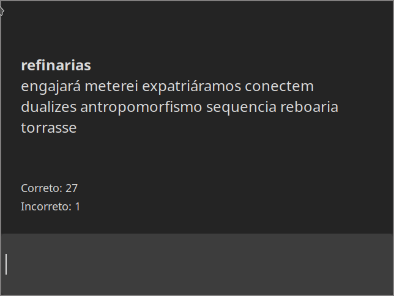

# Teste de digitação com GTK e Rust
Este é um programa feito com Rust e GTK que ajuda a treinar a digitação de palavras em lingua Portuguesa, são mais de 200 mil palavras disponíveis.

As palavras são mostradas na tela, sendo a palavra que você deve digitar a primeira palavra mostrada no topo e em negrito.

Quando finalizada a digitação da palavra, basta apertar no espaço para ir para a próxima, que corresponde a palavra em baixo.

No total são 10 palavras mostradas no preview.

No topo temos um indicador que diz se estamos digitando corretamente ou não, e embaixo temos um contador de palavras corretas e incorretas.

### Preview

# Dependências
- [gtk](https://crates.io/crates/gtk) - Criação da interface gráfica
- [rand](https://crates.io/crates/rand) - Nos permite gerar números aleatórios